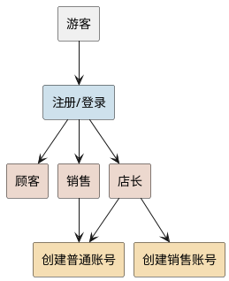
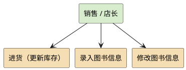
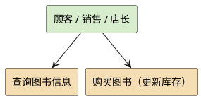
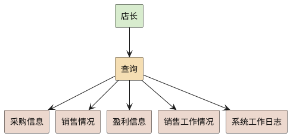
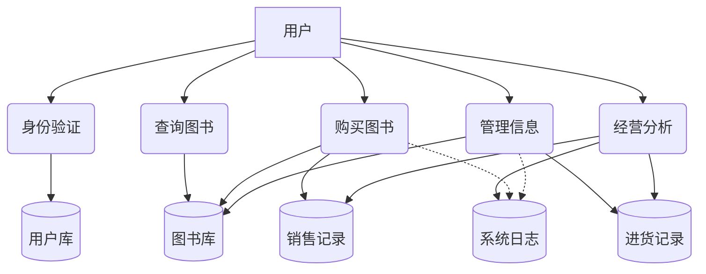

# 需求分析文档
## 业务流图

## 数据流图

## 数据词典
### 用户信息数据项
| 数据名称          |  数据类型  | 长度 | 含义      | 取值范围          | 相关模块      |
|:--------------|:------:|:--:|:--------|:--------------|:----------|
| u_id          | string | 20 | 用户唯一标识符 | 字母(大小写敏感）数字组合 | 用户管理、登录验证 |
| u_password    | string | 25 | 用户密码    | 字符串           | 身份验证      |
| u_role        |  ENUM  | -  | 用户角色权限  | 顾客/销售/店长      | 权限控制、功能分配 |
| register_time |  int   | -  | 注册时间    | 格式: YYYYMMDD  | 用户管理、系统日志 |

### 图书信息数据项
| 数据名称 |  数据类型  | 长度 | 含义     | 取值范围            | 
|:---|:------:|:--:|:-------|:----------------|
| book_ISBN | string | 20 | 国际标准书号 | 20字符            | 
| book_title | string | 60 | 图书标题   | 60字符            | 
| book_author | string | 60 | 作者姓名   | 60字符            |
| book_price | double | -  | 销售价格   | \>=0            | 
| book_stock |  INT   | -  | 库存数量   | \>=0            | 
| book_category | string | 60 | 图书关键字  | 可以有多个，总共不超过60字符 | 

### 销售记录数据项
| 数据名称          |  数据类型  |  长度  | 含义       | 取值范围         | 
|:--------------|:------:|:----:|:---------|:-------------|
| customer_id   | string |  20  | 顾客id     | 20字符         | 
| sale_ISBN     | string |  20  | 销售图书ISBN | 20字符         | 
| sale_quantity |  INT   |  -   | 销售数量     | \>0          |
| sale_time     |  int   |  -   | 销售时间     | 格式: YYYYMMDD |

### 进货记录数据项
| 数据名称              |  数据类型   | 长度  | 含义       | 取值范围         | 
|:------------------|:-------:|:---:|:---------|:-------------|
| operator_id       | string  | 20  | 进货销售id   | 20字符         |
| purchase_ISBN     | string  | 20  | 进货图书ISBN | 20字符         |
| unit_cost         | double  |  -  | 进货单价     | \>=0         | 
| purchase_quantity |   INT   |  -  | 销售数量     | \>0          |
| purchase_time     |   int   |  -  | 销售时间     | 格式: YYYYMMDD |

## 功能说明
### 1.用户管理
#### （1）注册
- 功能：注册新用户
- 输入：u_id, u_password   
- 输出：注册成功/注册失败  
- 处理：1. 验证用户名格式 2. 检查用户名是否重复 3. 创建用户并记录
- 权限：游客
- 相关文件：users.dat, system.log
#### （2）登录
- 功能：验证身份， 分配权限  
- 输入：u_id, u_password  
- 输出：登录成功/失败， 权限令牌  
- 处理：1.查询用户是否存在 2. 验证用户密码 3. 检查用户状态 4. 分配角色权限 5. 记录登录日志
- 权限：游客
- 相关文件：users.dat, system.log
#### （3）退出登录
- 功能：退出登录
- 输入：无  
- 输出：已登出  
- 处理：1. 验证当前登录状态 2. 记录登出日志 3.重置登录状态
- 权限：已登录用户
- 相关文件：system.log
#### （4）创建用户
- 功能：创建用户账号
- 输入：u_id, u_password  
- 输出：创建成功/失败  
- 处理：1. 验证操作权限 2. 检查用户是否存在 3. 执行操作 4. 更新用户库 5. 记录日志  
- 权限：销售， 店长  
- 相关文件：users.dat, system.log
### 2.图书管理
#### （1）图书信息管理
- 功能：管理图书信息  
- 输入：action(操作类型), book_ISBN, book_title, book_author, book_price, book_stock, book_category  
- 输出：操作成功/失败  
- 处理：1. 验证操作权限 2. 执行操作(添加/修改/删除) 3. 更新图书库 4. 记录操作日志  
- 权限：销售， 店长  
- 相关文件：books.dat, system.log  
#### （2）图书进货
- 功能：处理图书进货业务，更新库存和成本信息  
- 输入：book_ISBN, purchase_quantity, unit_cost  
- 输出：进货成功/失败， 进货后库存  
- 处理：1. 验证图书信息 2. 更新库存 3. 计算成本 4. 记录进货 5. 记录日志  
- 权限：销售， 店长
- 相关文件：books.dat, purchase.log, system.log  
#### （3）查询图书
- 功能：查询相关图书
- 输入：search_type(查询类型), book_category/ book_ISBN/ book_author   
- 输出：符合条件的图书列表：book_info(该图书所有相关信息)  
- 处理：1. 解析查询条件 2. 从图书库检索 3. 结果排序 4. 返回匹配列表  
- 权限：顾客， 销售， 店长  
- 相关文件：books.dat, system.log  
#### （4）购买图书
- 功能：购买图书
- 输入：book_ISBN, sale_quantity  
- 输出：购买成功/失败， 支付金额  
- 处理：1. 验证库存 2. 计算金额 3. 扣减库存 4. 生成销售记录 5. 更新日志  
- 权限：顾客，销售， 店长
- 相关文件：books.dat, sales.log, system.log
### 3.经营管理
#### （1）经营分析
- 功能：生成销售、进货、利润等经营报表
- 输入：报表类型
- 输出：报表
- 处理；读取文件
- 权限：店长
- 相关文件：sales.log, purchase.log, system.log
#### (2)系统日志
- 功能：查看系统工作日志
- 输入：无
- 输出：系统日志
- 处理：读取文件
- 权限：店长
- 相关文件：system.log