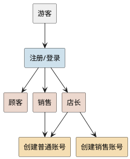
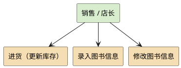
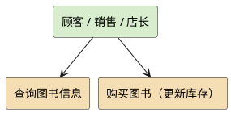
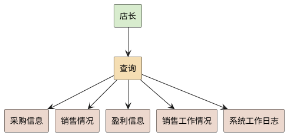
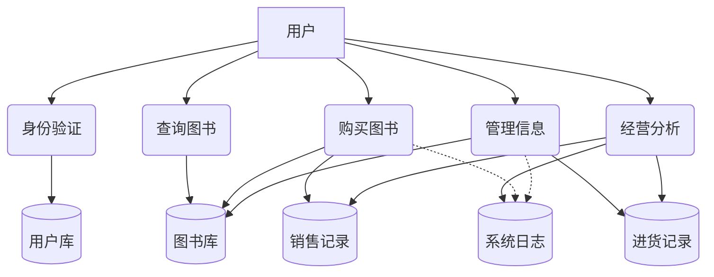

```plantuml
@startuml
skinparam nodesep 10
skinparam ranksep 50
skinparam nodeStyle roundedBox
skinparam nodeBackgroundColor #f5deb3

rectangle "游客" as guest #f0f0f0
rectangle "注册/登录" as register #cee1ec
rectangle "顾客" as customer #ecd8ce
rectangle "销售" as salesman #ecd8ce
rectangle "店长" as manager #ecd8ce

rectangle "创建普通账号" as create_normal #f5deb3
rectangle "创建销售账号" as create_sales #f5deb3
guest --> register
register --> customer
register --> salesman
register --> manager

salesman --> create_normal
manager --> create_normal
manager --> create_sales
@enduml
```

```plantuml
@startuml
skinparam nodesep 10
skinparam ranksep 50
skinparam nodeStyle roundedBox
skinparam nodeBackgroundColor #f5deb3

rectangle "销售 / 店长" as sales #d8ecce

rectangle "进货（更新库存）" as import_and_new #f5deb3
rectangle "录入图书信息" as record #f5deb3
rectangle "修改图书信息" as change #f5deb3

sales --> import_and_new
sales --> record
sales --> change
@enduml
```

```plantuml
@startuml
skinparam nodesep 10
skinparam ranksep 50
skinparam nodeStyle roundedBox
skinparam nodeBackgroundColor #f5deb3

rectangle "顾客 / 销售 / 店长" as buyer #d8ecce

rectangle "查询图书信息" as inquire #f5deb3
rectangle "购买图书（更新库存）" as buy #f5deb3

buyer --> inquire
buyer --> buy
@enduml
```

```plantuml
@startuml
skinparam nodesep 10
skinparam ranksep 50
skinparam nodeStyle roundedBox
skinparam nodeBackgroundColor #f5deb3

rectangle "店长" as manager #d8ecce
rectangle "查询" as inquire #f5deb3
rectangle "采购信息" as purchase_info #ecd8ce
rectangle "销售情况" as sale_info #ecd8ce
rectangle "盈利信息" as profit_info #ecd8ce
rectangle "销售工作情况" as work_info #ecd8ce
rectangle "系统工作日志" as total_info #ecd8ce

manager --> inquire
inquire --> purchase_info
inquire --> sale_info
inquire --> profit_info
inquire --> work_info
inquire --> total_info
@enduml
```

```mermaid
flowchart TD
    U[用户] --> P1(身份验证)
    U --> P2(查询图书)
    U --> P3(购买图书)
    U --> P4(管理信息)
    U --> P5(经营分析)

%% 核心数据流
    P1 --> D1[(用户库)]
    P2 --> D2[(图书库)]
    P3 --> D2
    P3 --> D3[(销售记录)]
    P4 --> D2
    P4 --> D4[(进货记录)]
    P5 --> D3
    P5 --> D4
    P5 --> D5[(系统日志)]

%% 统一日志记录
    P3 -.-> D5
    P4 -.-> D5
```